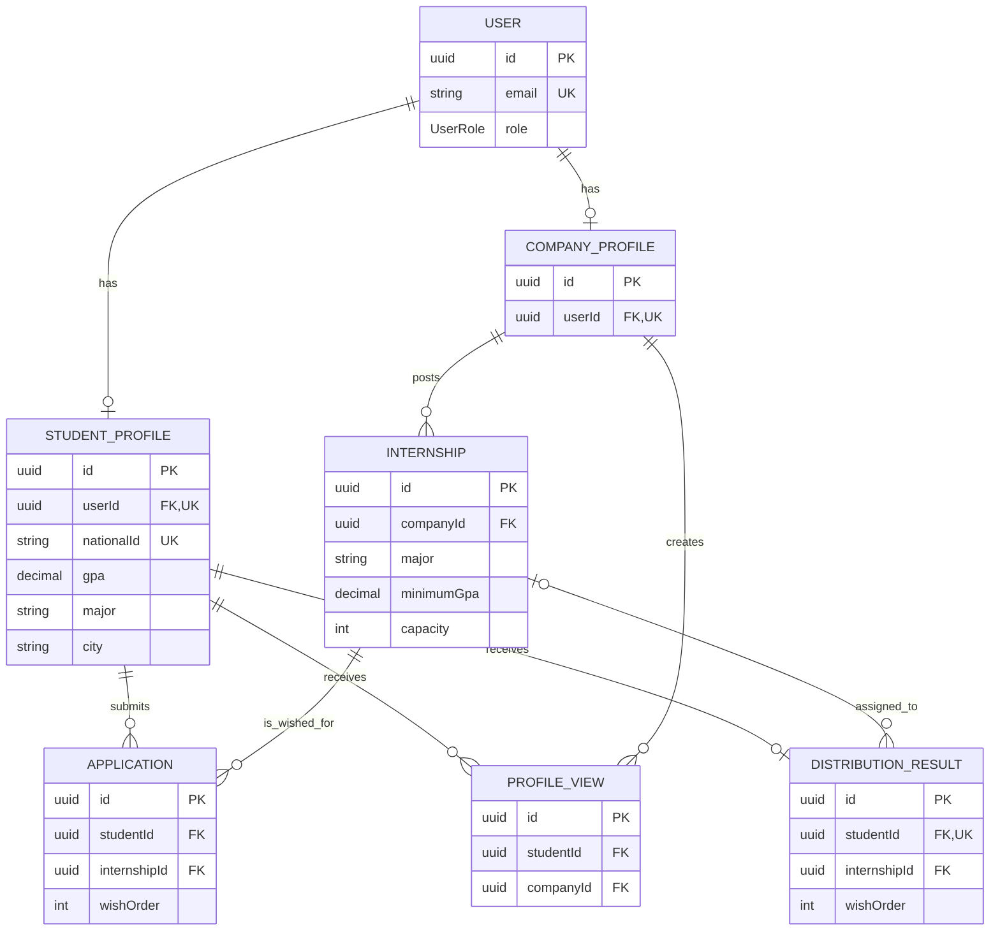

# InternMatch ERD

## Design decisions

- `User` is separated from `StudentProfile` and `CompanyProfile` so authentication identity and role remain independent of role-specific information.
- `Application` represents one ranked internship wish; its unique constraints prevent duplicate wishes and duplicate ranking positions per student.
- Major and city remain strings because their permitted values are not defined.
- Internship capacity is an assumption needed to make ranking and distribution meaningful.
- `ProfileView` records individual viewing events, enabling a student's view count to be derived.
- Only the current `DistributionResult` is stored; ranking and distribution history are out of scope.
